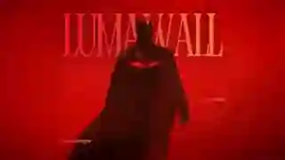
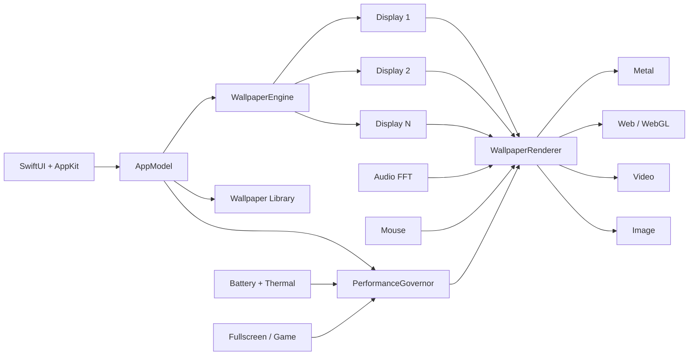

<div align="center">

<sub>◉ LIVE DESKTOP ENGINE · macOS 14+</sub>

# LumaWall

### Your desktop shouldn't have to stand still.

A native macOS live-wallpaper engine built with **SwiftUI, AppKit, Metal, WebKit and AVFoundation**.

<p>
  
  
  
  
</p>

</div>

<br/>

<p align="center">
  
</p>

<p align="center">
  <sub>▲ Actual LumaWall wallpaper capture · preview generated from the supplied 4K / 60 FPS demo</sub>
</p>

<br/>

<div align="center">

**METAL** · **WEBGL** · **VIDEO** · **AUDIO REACTIVE** · **MULTI-DISPLAY** · **RETINA**

[Quick Start](#-quick-start) · [Engine](#-the-engine) · [Create](#-wall-packages) · [Architecture](#-architecture) · [Docs](#-documentation)

</div>

---

> [!IMPORTANT]
> **LumaWall is a native Mac app, not a browser wrapped in a desktop shell.**  
> The control surface is SwiftUI/AppKit. Web content is only one optional wallpaper renderer beside Metal, video and images.

## ✦ One app. Four rendering worlds.

<table>
<tr>
<td width="50%" valign="top">

### ⚡ Metal
Procedural scenes rendered directly on the GPU through `MTKView`.

**Built for:** particles, shaders, audio-reactive scenes, mouse-reactive effects.

</td>
<td width="50%" valign="top">

### ◈ Web / WebGL
Creative HTML, Canvas and WebGL wallpapers inside `WKWebView`.

**Built for:** portable scenes, shader experiments and web-native artwork.

</td>
</tr>
<tr>
<td width="50%" valign="top">

### ▶ Video
Hardware-friendly looping playback powered by AVFoundation.

**Built for:** cinematic backgrounds and high-quality motion loops.

</td>
<td width="50%" valign="top">

### ◌ Image
Simple, efficient static backgrounds through native AppKit rendering.

**Built for:** maximum efficiency when motion is unnecessary.

</td>
</tr>
</table>

## 🔴 The engine

LumaWall treats every display as an independent render surface.

| SYSTEM | WHAT LUMAWALL DOES |
|---|---|
| **DISPLAY** | Renders at native backing-pixel resolution and reacts to display/scaling changes |
| **FRAME** | Supports **30 / 60 / 120 FPS** targets |
| **POWER** | Adapts to battery state and thermal pressure |
| **QUALITY** | Automatic · Eco · Balanced · Ultra · Custom |
| **INPUT** | Normalized mouse coordinates per display without stealing Finder interaction |
| **AUDIO** | Permission-gated system-audio FFT data for reactive scenes |
| **FOCUS** | Can auto-pause for fullscreen apps and games |
| **RECOVERY** | Safe Mode, stop-all, assignment reset and diagnostics are built into the app |

### Hardware-aware by default

LumaWall detects the current **Mac model, Apple GPU/chip, memory, CPU, native display dimensions, Retina scale and refresh capability**.

That information feeds the performance governor so the wallpaper can look sharp without behaving like a foreground workload.

```text
RENDER TARGET     native Retina backing pixels
FRAME CEILING     30 / 60 / 120 FPS
POWER POLICY      adaptive
THERMAL POLICY    adaptive
DISPLAY POLICY    independent per monitor
```

---

## 🚀 Quick start

> [!NOTE]
> Packaging and release automation are already in the repository, but there is **not yet a public GitHub Release**. For now, run LumaWall from source.

### Requirements

- macOS **14 Sonoma or newer**
- full **Xcode** installation with Swift 6 and Metal tooling
- Git

```bash
git clone https://github.com/parthdongre/LumaWall.git
cd LumaWall

make run
```

Or:

```bash
swift run LumaWall
```

### Build / test / package

```bash
make build
make test
make package
```

Packaging creates:

```text
dist/
├── LumaWall.app
├── LumaWall-0.4.0-macOS.zip
├── LumaWall-0.4.0.dmg
├── LumaWall-0.4.0.pkg
└── SHA256SUMS.txt
```

Install the locally packaged app into `/Applications`:

```bash
make install
```

<details>
<summary><strong>Seeing “unable to spawn process 'metal'”?</strong></summary>

<br/>

LumaWall's Metal shaders require the full Xcode developer toolchain.

```bash
sudo xcode-select --switch /Applications/Xcode.app/Contents/Developer
xcodebuild -version
xcrun -f metal
```

Then rebuild LumaWall.

</details>

---

## 🧠 Architecture



The core architectural rule is deliberately boring:

> **Wallpaper orchestration and wallpaper rendering are separate systems.**

Every backend receives playback, frame-rate, render-scale and interaction events through the same renderer contract. That keeps the app predictable even as wallpaper technologies change.

[Read the architecture notes →](docs/architecture.md)

---

## 📦 `.wall` packages

LumaWall wallpapers can be distributed as self-contained packages.

```text
MyWallpaper.wall/
├── wallpaper.json
├── thumbnail.jpg          # optional
├── preview.mp4            # optional
└── assets/
    ├── index.html
    ├── wallpaper.mp4
    └── shader.metal
```

A package can describe its renderer, metadata, assets and creator-facing controls.

LumaWall can expose creator properties such as:

```text
◉ slider      intensity
◉ color       accent
◉ toggle      audioReactive
◉ dropdown    qualityMode
```

Installed app bundles register `.wall` with macOS, allowing packages to be opened from Finder and imported into the library.

[Wallpaper format](docs/wallpaper-format.md) · [Creator API](docs/creator-api.md) · [Security model](docs/security.md)

---

## ✦ Built like a Mac app

<table>
<tr>
<td width="33%" align="center"><b>Retina native</b><br/><sub>backing-pixel render targets</sub></td>
<td width="33%" align="center"><b>Multi-display</b><br/><sub>one renderer per active display</sub></td>
<td width="33%" align="center"><b>Menu bar</b><br/><sub>fast wallpaper controls</sub></td>
</tr>
<tr>
<td width="33%" align="center"><b>Launch at login</b><br/><sub>native macOS integration</sub></td>
<td width="33%" align="center"><b>Safe Mode</b><br/><sub>recover without Terminal</sub></td>
<td width="33%" align="center"><b>Diagnostics</b><br/><sub>inspect runtime + display state</sub></td>
</tr>
</table>

The product surface already includes library search, favorites, recents, renderer filters, per-display assignment, playlists, schedules, creator controls, updates, recovery and diagnostics.

---

## 🗂 Repository

```text
Sources/LumaWall/
├── App/             app lifecycle + state
├── Audio/           system-audio analysis
├── Engine/          wallpaper orchestration
├── Interaction/     mouse / input bridge
├── Library/         import + wallpaper library
├── Performance/     adaptive render policy
├── Renderers/       Metal · Web · Video · Image
├── Scheduling/      playlists + schedules
├── Security/        content boundaries
├── Views/           SwiftUI interface
└── Resources/       shaders + built-in wallpapers
```

---

## 📚 Documentation

| | |
|---|---|
| **[Architecture](docs/architecture.md)** | engine structure and renderer contract |
| **[Wallpaper format](docs/wallpaper-format.md)** | package manifest and asset layout |
| **[Creator API](docs/creator-api.md)** | properties and interaction bridges |
| **[Security](docs/security.md)** | untrusted-content and permission boundaries |
| **[Distribution](docs/distribution.md)** | app bundle, ZIP, DMG, PKG, signing |
| **[Changelog](CHANGELOG.md)** | shipped milestones |
| **[Engineering notes](steps.md)** | implementation decisions and project evolution |

---

## ⌘ Development

```bash
make run       # launch
make build     # compile
make test      # test
make package   # app + ZIP + DMG + PKG
make install   # install into /Applications
make clean     # clean build artifacts
```

CI builds and tests on macOS, captures UI screenshots, packages installable artifacts and supports tag-driven release builds.

---

<div align="center">

### Make the wallpaper part of the machine.

**Built for macOS. Rendered by the GPU. Quiet when you need the performance back.**

<sub>SwiftUI · AppKit · Metal · WebKit · AVFoundation</sub>

</div>
