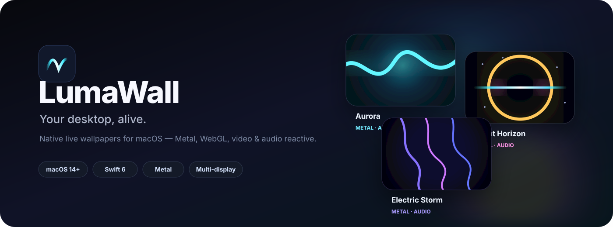

  

  
  
  
  

  <strong>A Wallpaper Engine-style experience, built natively for macOS.</strong> 
  Metal shaders. WebGL. Video. Audio reactivity. Multi-display control. Adaptive performance.

  <a href="#-quick-start"><strong>Quick start</strong></a>
  ·
  <a href="#-wallpaper-engine"><strong>Engine</strong></a>
  ·
  <a href="#-wall-packages"><strong>Create wallpapers</strong></a>
  ·
  <a href="#-architecture"><strong>Architecture</strong></a>
  ·
  <a href="#-documentation"><strong>Docs</strong></a>

---

## ✦ What is LumaWall?

**LumaWall** turns the macOS desktop into a programmable visual surface.

The app shell is native **SwiftUI + AppKit**, while wallpapers can be rendered through **Metal**, **Web/WebGL**, **AVFoundation video**, or static images. LumaWall manages each display independently and continuously adapts rendering to the Mac's hardware, battery state, thermal state, refresh rate, and native Retina resolution.

> **Native app. Native windows. Native GPU pipeline.**  
> Web content is an optional wallpaper backend — not the application shell.

### Why it stands out

| | |
|---|---|
| 🖥️ **Per-display wallpapers** | Assign different scenes to different monitors with native-resolution render targets. |
| ⚡ **Hardware-aware rendering** | Detects Mac model, Apple GPU/chip, memory, CPU, display scale and refresh capability. |
| 🎵 **Audio reactive** | Wallpapers can respond to permission-gated system-audio FFT data. |
| 🖱️ **Interactive scenes** | Global mouse coordinates are normalized per display without stealing Finder interaction. |
| 🌡️ **Adaptive performance** | Automatic, Eco, Balanced and Ultra modes respond to battery and thermal pressure. |
| 🎮 **Stay out of the way** | Fullscreen/game auto-pause and menu-bar controls keep desktop effects unobtrusive. |
| 🎛️ **Creator controls** | Sliders, colors, toggles and dropdowns can be exposed by a wallpaper and persisted by LumaWall. |
| 📦 **Portable .wall packages** | Import/export local wallpaper bundles with manifests, assets, thumbnails and previews. |
| 🛟 **Recovery built in** | Safe Mode, stop-all, assignment reset, diagnostics and crash-report access live inside the app. |
| ✨ **macOS-first UX** | Library, search, favorites, recents, schedules, playlists, updates and onboarding are all in-app. |

---

## 🎨 Wallpaper engine

LumaWall uses one rendering contract across multiple backends:

| Renderer | Best for | Stack |
|---|---|---|
| **Metal** | Procedural, GPU-heavy, interactive scenes | Metal + MTKView |
| **Web / WebGL** | Canvas, shaders, creative web scenes | WKWebView |
| **Video** | Cinematic loops and motion backgrounds | AVFoundation |
| **Image** | Lightweight static wallpapers | AppKit / NSImage |

The built-in collection already includes procedural scenes such as **Aurora**, **Event Horizon**, **Electric Storm**, **Cosmic Dust**, and audio-reactive experiences.

### Performance controls

- **30 / 60 / 120 FPS** targets
- **Automatic / Eco / Balanced / Ultra / Custom** quality
- **Maximum Resolution** mode for native backing-pixel rendering
- manual render scale when efficiency matters more than sharpness
- adaptive battery and thermal throttling
- automatic hardware tuning
- live display-change handling without restarting the app

---

## 🚀 Quick start

> [!NOTE]
> LumaWall has packaging and release automation in place, but **there is not yet a public GitHub Release** in this repository. Until the first release is published, build from source.

### Requirements

- macOS **14 Sonoma or later**
- Xcode with the **Swift 6 / Metal toolchain**
- Git

### Run from source

~~~bash
git clone https://github.com/parthdongre/LumaWall.git
cd LumaWall
make run
~~~

Or directly:

~~~bash
swift run LumaWall
~~~

### Build & test

~~~bash
make build
make test
~~~

### Package like a real macOS app

~~~bash
make package
~~~

This produces an app bundle plus distributable **ZIP, DMG, PKG, and SHA-256 checksums** inside <code>dist/</code>.

For a local Applications install:

~~~bash
make install
~~~

> If <code>swift run</code> reports that it cannot spawn <code>metal</code>, make sure full Xcode is installed and selected as the active developer toolchain.

---

## 📦 .wall packages

LumaWall has its own portable wallpaper package format:

~~~text
MyWallpaper.wall/
├── wallpaper.json
├── thumbnail.jpg          # optional
├── preview.mp4            # optional
└── assets/
    ├── index.html
    ├── wallpaper.mp4
    └── shader.metal
~~~

A package can define its renderer, local assets, metadata and creator-facing properties. Installed builds register <code>.wall</code> with macOS so packages can be opened from Finder and imported into the library.

**Creator references:** [Wallpaper format](docs/wallpaper-format.md) · [Creator API](docs/creator-api.md) · [Security model](docs/security.md)

---

## 🧠 Architecture

~~~mermaid
flowchart TD
    UI["SwiftUI App + Menu Bar"] --> MODEL["AppModel"]
    MODEL --> ENGINE["WallpaperEngine"]
    MODEL --> LIB["Wallpaper Library"]
    MODEL --> PERF["PerformanceGovernor"]

    ENGINE --> D1["Display 1 Window"]
    ENGINE --> D2["Display 2 Window"]
    ENGINE --> DN["Display N Window"]

    D1 --> R["WallpaperRenderer"]
    D2 --> R
    DN --> R

    R --> METAL["Metal / MTKView"]
    R --> WEB["Web / WKWebView"]
    R --> VIDEO["Video / AVFoundation"]
    R --> IMAGE["Image / AppKit"]

    AUDIO["System Audio FFT"] --> R
    MOUSE["Global Mouse Input"] --> R
    PERF --> R

    PERF --> POWER["Battery / Thermal"]
    PERF --> FULL["Fullscreen / Game Detection"]
~~~

The key design decision is simple: **orchestration is separate from rendering**. Every backend conforms to the same renderer interface, so display assignment, playback, FPS, render scale, interaction, recovery and performance policy remain consistent.

For the deeper implementation view, see [docs/architecture.md](docs/architecture.md).

---

## 🧩 Product surface

**Library & discovery** — search, filters, favorites, recents, renderer scopes, sorting, previews and active-display badges.

**Desktop control** — per-display assignment, stop-one/stop-all, menu-bar quick switching, playlists and scheduling.

**Creator experience** — persistent wallpaper properties, reset controls, local assets, Web/Metal interaction bridges and package import/export.

**System integration** — launch at login, Finder <code>.wall</code> association, macOS updates flow, hardware/display inspection and native Retina output.

**Reliability** — safe launch mode, saved-assignment recovery, runtime diagnostics, crash-report access and adaptive resource usage.

---

## 🗂️ Repository map

~~~text
LumaWall/
├── Sources/LumaWall/
│   ├── App/             # app lifecycle and app model
│   ├── Engine/          # wallpaper orchestration
│   ├── Renderers/       # Metal, Web, Video, Image
│   ├── Performance/     # adaptive rendering policy
│   ├── Audio/           # audio analysis
│   ├── Interaction/     # mouse / interactive input
│   ├── Library/         # wallpaper library and imports
│   ├── Scheduling/      # playlists and schedules
│   ├── Security/        # content safety boundaries
│   ├── Views/           # SwiftUI product UI
│   └── Resources/       # shaders and built-in wallpapers
├── Examples/            # example .wall packages
├── Tests/
├── docs/
└── scripts/             # packaging and local install tooling
~~~

---

## 📚 Documentation

| Document | Purpose |
|---|---|
| [Architecture](docs/architecture.md) | Engine structure and renderer contract |
| [Wallpaper format](docs/wallpaper-format.md) | <code>.wall</code> package layout and manifest |
| [Creator API](docs/creator-api.md) | Interactive properties and wallpaper bridges |
| [Security](docs/security.md) | Untrusted-content boundaries and permissions |
| [Distribution](docs/distribution.md) | DMG/PKG/ZIP, signing and release pipeline |
| [Changelog](CHANGELOG.md) | Product milestones and version history |
| [Implementation notes](steps.md) | Major engineering decisions and project evolution |

---

## 🛠️ Development

Useful commands:

~~~bash
make run       # run the app
make build     # compile
make test      # run tests
make package   # build .app + ZIP + DMG + PKG
make install   # package and install locally
make clean     # remove .build and dist
~~~

CI builds and tests LumaWall on macOS, captures UI screenshots, packages installable artifacts, and supports tag-driven releases.

---

## 🌌 Direction

LumaWall is aiming at a simple idea: **make dynamic desktops feel like a first-class macOS capability** — visually ambitious, creator-friendly, efficient on Apple silicon, and invisible when the user needs performance elsewhere.

If that sounds useful, **star the repository**, try a wallpaper, or open an issue with a scene/engine idea.

  <strong>Built for the Mac. Rendered by the GPU. Designed to disappear into the desktop.</strong>

